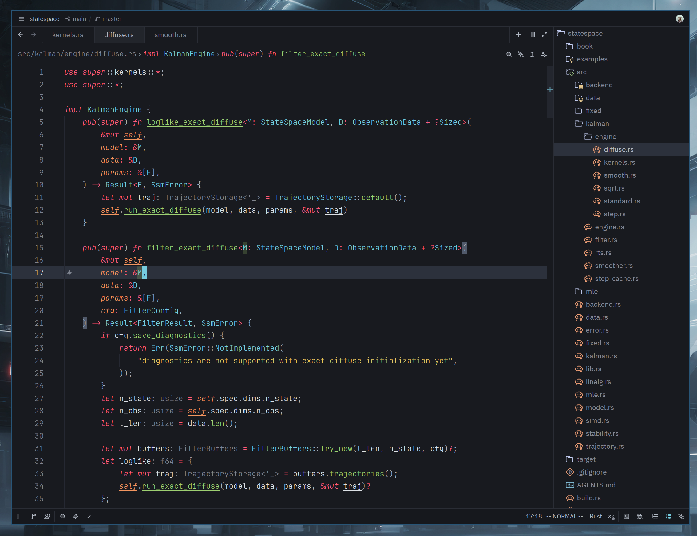

# Arctikai ❄️

A cool-toned, muted, and restrained dark theme for [Zed](https://zed.dev/).

Arctikai is inspired by the Monokai Pro color scheme, with additional influence from
[Monokai Pirokai](https://github.com/lakshits11/monokai-pirokai). It keeps the
Monokai energy, but shifts it toward a colder, quieter palette for long focused
coding sessions.

## Preview 🖼️



## Installation 📦

### From Zed Extensions

1. Open Zed.
2. Open the command palette with `Cmd`+`Shift`+`P` on macOS or `Ctrl`+`Shift`+`P` on Linux/Windows.
3. Run `zed: extensions`.
4. Search for `Arctikai` and install the extension.
5. Run `theme selector: toggle` and select `Arctikai`.

### Manual Installation

Clone the repository and copy the theme into your Zed themes directory:

```sh
git clone https://github.com/hexqnt/arctikai.git
cd arctikai
mkdir -p ~/.config/zed/themes
cp themes/arctikai.json ~/.config/zed/themes/
```

Then restart Zed or run `workspace: reload`, open `theme selector: toggle`, and choose `Arctikai`.

## Recommended icons

For file icons, [Catppuccin Icons](https://zed.dev/extensions/catppuccin-icons)
are recommended. They are fairly close in color scheme.

## Recommended Zed Settings ⚙️

Some visual details are controlled by Zed settings rather than the theme schema.
You can add this to your Zed `settings.json` and adjust it to taste:

```jsonc
{
  "theme": {
    // Keep Arctikai selected for dark mode.
    "mode": "system",
    "dark": "Arctikai"
  },

  // Recommended coding fonts.
  // Try these in order:
  // - "JetBrainsMono Nerd Font"
  // - "Fira Code Nerd Font"
  // - "Hack Nerd Font"
  "buffer_font_family": "JetBrainsMono Nerd Font",
  "buffer_font_fallbacks": ["Fira Code Nerd Font", "Hack Nerd Font"]

  // Use the same family in the integrated terminal for consistent icons/glyphs.
  "terminal": {
    "font_family": "JetBrainsMono Nerd Font",
  },

  // Arctikai is tuned to look good with programming ligatures enabled.
  "buffer_font_features": {
    "calt": true,
    "liga": true,
    "zero": true,
  }

  // I like to see mutable and immutable variables in code
  "global_lsp_settings": {
    "semantic_token_rules": [
      {
        "token_modifiers": ["mutable"],
        "underline": true,
      },
    ],
  },

  // Languages for which this makes sense.
  // Will work if the LSP can return a mutable modifier
  "languages": {
    "Rust": {
      "semantic_tokens": "combined",
    },
    "Zig": {
      "semantic_tokens": "combined"
    },
    "Kotlin": {
      "semantic_tokens": "combined",
    },
    "Swift": {
      "semantic_tokens": "combined",
    },
    "Scala": {
      "semantic_tokens": "combined",
    },
  },

}
```
